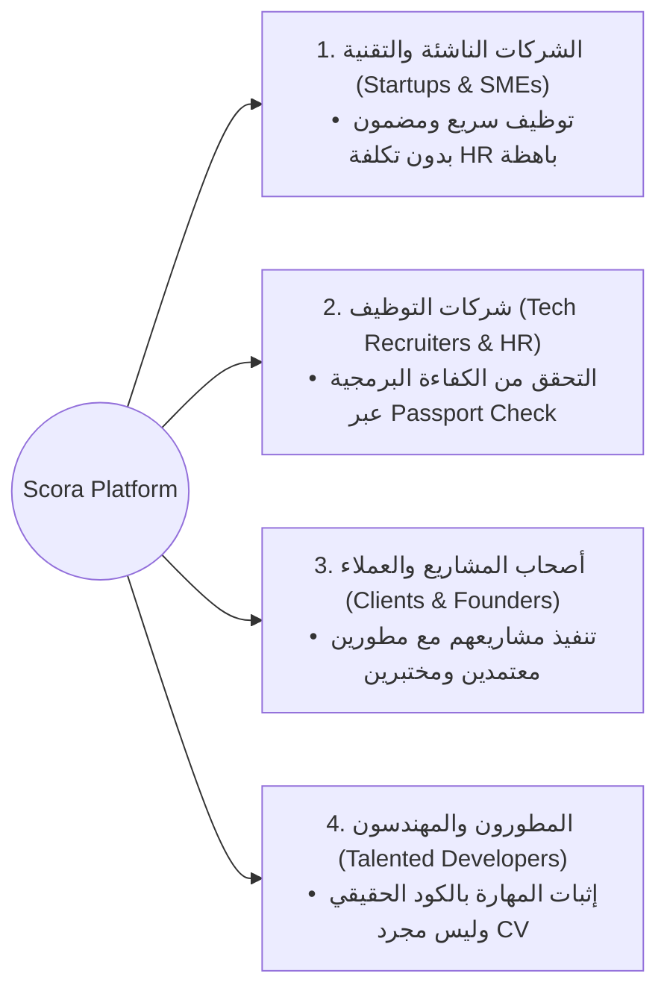
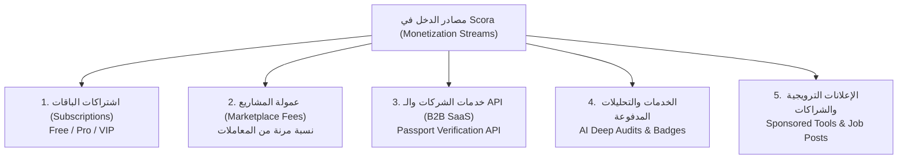

# 5. Business and Market — Scora Platform

---

## 1. السوق المستهدف (Target Market)

يستهدف مشروع **Scora** قطاعات رئيسية تعاني من فجوة الثقة وارتفاع تكلفة التقييم والتوظيف التقني:

### تفصيل الشرائح المستهدفة:
1. **الشركات الناشئة والمتوسطة (Tech Startups & SMEs)**:
   - الشركات التي تبحث عن مطورين موثوقين ومختبرين مسبقاً لبدء العمل فوراً دون إهدار أسابيع وميزانيات ضخمة في لجان تقييم تقنية فاشلة (Vetting as a Service).
2. **شركات ومسؤولو التوظيف (Tech Recruiters & Enterprise HR)**:
   - وكالات التوظيف والشركات الكبرى التي تحتاج أداة قياس وتدقيق مستقلة (Technical Audit & Skill Verification) للتأكد من مهارات المرشحين.
3. **أصحاب الأعمال والمنتجات (Product Owners & Clients)**:
   - الأفراد والشركات الراغبين في بناء حلول رقمية ويبحثون عن مطورين أصحاب جدارة فعلية مع ضمان إنجاز المشاريع بجودة واحترافية.
4. **المطورون المستقلون والباحثون عن فرص (Vetted Developers)**:
   - الكفاءات البرمجية التي تملك مهارات حقيقية وترغب في التميز عن الحسابات الوهمية وضعيفة الخبرة في المنصات التقليدية.

---

## 2. كيف يتحول المشروع إلى Business حقيقي ومستدام؟ (Transition to a Real Business)

يتحول **Scora** من مجرد موقع خدمات إلى بيئة عمل متكاملة (**Market-Network Ecosystem**) من خلال:

1. **معيار التوثيق التقني الموحد (The Scora Passport)**:
   - جعل درجة الثقة (**Trust Score**) ونقاط المهارة (**Skill Points - SP**) المعيار المعتمد للمطور في سوق العمل الرقمي، بحيث يصبح "جواز سفر تقني" يثبت كفاءة المطور عالمياً.
2. **الجمع بين منصة العمل وشبكة التواصل المهني (Professional Tech Community)**:
   - دمج سوق العمل مع خلاصة تفاعلية (**Tech Feeds & Networking**) شبيهة بـ LinkedIn ولكن مخصصة للمطورين والتقنيين، تتيح نشر الأكواد، الإنجازات، الإشارات (Mentions)، وتبادل الخبرات، مما يضمن بقاء المستخدمين يومياً داخل المنصة (High User Retention & DAU).
3. **التوفيق الذكي القائم على الذكاء الاصطناعي (AI-Driven Smart Matchmaking)**:
   - مساعدة الشركات وأصحاب المشاريع في الوصول إلى أفضل مطور مناسب لمشروعهم في ثوانٍ بناءً على سجل المشاريع الفعلية ونتائج التقييم الحي.

---

## 3. نموذج العمل ومصادر الدخل (Business Model & Monetization)

يعتمد Scora على **نموذج دخل متعدد الروافد (Multi-Stream Revenue Model)** يضمن استدامة التدفقات النقدية:

### تفصيل مصادر الدخل:

### 1. اشتراكات الباقات الدورية (Tiered SaaS Subscriptions):
- **باقة Free**: وصول أساسي للتقديم على المشاريع واستخدام محدود لمساعد SSD.
- **باقة Pro**: زيادة عدد عروض التقديم، شارة تمييز، كوتة ذكاء اصطناعي مضاعفة، وأولوية الظهور في نتائج البحث للعملاء.
- **باقة VIP**: دعم مخصص، تحليل أداء متقدم، وصول غير محدود لمساعد SSD، ورسوم عمولة مخفضة.

### 2. عمولة المعاملات والمشاريع (Marketplace Commission & Escrow):
- نسبة مرونة وعادلة تُقتطع من قيمة المشاريع المنفذة عبر المنصة مع توفير حماية كاملة للمستحقات (Milestone Protection).

### 3. خدمة تدقيق وفحص المطورين للشركات (B2B Passport Check & API):
- توفير **Enterprise API** لشركات التوظيف والبرمجيات لفحص سجل المطور ودرجة الثقة ونتائج الاختبارات والتقييمات المعتمدة آلياً قبل التعاقد.

### 4. الخدمات الإضافية ذات القيمة المضافة (Value-Added Paid Services):
- **فحص وتقييم عميق للأكواد (AI Deep Code Audits)**: تقارير تفصيلية لتحليل جودة وهندسة مشاريع العملاء والمطورين.
- **إعادة التقييم السريع والاعتماد المسبق (Fast-Track Assessment)**: رسوم للمطورين الراغبين في تسريع اعتماد شارات التوثيق.
- **تمييز الوظائف والمشاريع (Featured Project Listings)**: إمكانية تثبيت المشاريع للوصول لأفضل 5% من المطورين.

### 5. الإعلانات والشراكات التقنية (Sponsored Content & Partnerships):
- الترويج لأدوات التطوير السحابية (Cloud Hosting, SaaS, Developer Tools) داخل الـ Feeds بشكل مخصص ومستهدف لمجتمع المطورين.

---

## 4. الأثر وإمكانات النمو والتوسع (Impact & Growth Potential)

### 1. حل معضلة "السوق المائل" (Solving the Lemon Market in Tech Freelancing):
- تعاني منصات العمل الحر الحالية من كثرة العروض الرديئة والملفات الوهمية. يقدم Scora حلاً جذرياً عبر **شرط إثبات المهارة قبل التقديم**، مما يرفع متوسط جودة المشاريع ويرسخ الأمان لدى العملاء.

### 2. التفاعل والمجتمع التقني الحي (Interactive Social & Feeds Impact):
- تحويل المنصة من مجرد أداة لإنجاز المهام إلى مجتمع مهني متكامل عبر:
  - **Feed منشورات تقنية** للأكواد والتجارب البرمجية.
  - **نظام الإشارات (Mentions & Tags)** للتفاعل بين المطورين والشركات.
  - **شهادات الكفاءة وجوائز التحديات (Skill Badges & Hackathons)**.

### 3. قابلية التوسع الإقليمي والعالمي (Scalability):
- **المرحلة الأولى**: الاستحواذ على سوق العمل الحر والتوظيف التقني في مصر ومنطقة الشرق الأوسط وشمال أفريقيا (MENA) لسد الفجوة بين الخريجين واحتياجات السوق.
- **المرحلة الثانية**: التوسع كمنصة عالمية لتصدير الكفاءات البرمجية المعتمدة (Remote Tech Talent Export) للشركات في أوروبا والخليج وأمريكا.
