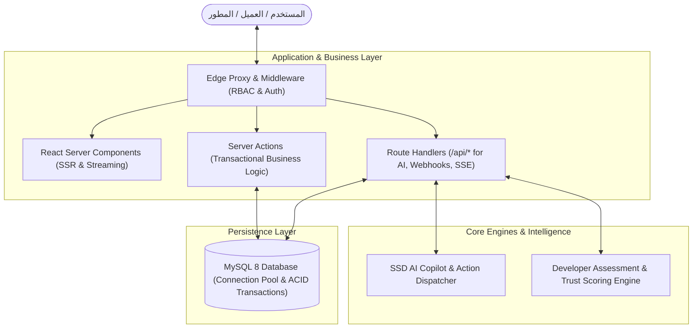

# 4. Technical Implementation — Scora Platform

---

## 1. System Architecture (بنية النظام)

يعتمد مشروع **Scora** على معمارية **3-Tier Edge-Ready / Serverless Architecture** متقدمة مبنية على إطار عمل **Next.js 16 (App Router)** مع فصل دقيق بين طبقة العرض، منطق الأعمال، ومحركات الذكاء الاصطناعي وقواعد البيانات:



### تفصيل طبقات البنية المعمارية:
1. **Client / Presentation Layer**:
   - واجهات تفاعلية متجاوبة مبنية باستخدام **React 19 Client Components** و **TailwindCSS v4**.
   - دعم كامل وتلقائي لاتجاه الواجهة العربي (**RTL**).
   - بيئة تطوير واختبار برمجية مدمجة للمطورين تعتمد على محرك **Monaco Editor**.
2. **Security & Edge Proxy Layer**:
   - وسيط برميجي خفيف (`proxy.ts` / Edge Middleware) يعترض جميع الطلبات الواردة.
   - التحقق اللحظي من توقيع جلسات المستخدمين المشفرة (**Stateless JWT**) دون استهلاك موارد الخادم.
   - تطبيق نظام التحكم في الوصول القائم على الأدوار (**RBAC**) بين الأدمن، المطور، وصاحب العمل.
3. **Application & Business Logic Layer**:
   - **Server Actions**: مسؤولة عن كافة عمليات الإنشاء، التعديل، والحذف مع حماية تلقائية من هجمات CSRF وتحديث الكاش لحظياً (`revalidatePath`).
   - **Route Handlers (`/api/*`)**: مسؤولة عن عمليات البث الحي للذكاء الاصطناعي (Streaming)، تقييم الأكواد، وفحص النبضات الدورية (Heartbeats).
4. **Data Persistence Layer**:
   - قاعدة بيانات **MySQL 8** متصلة عبر **Connection Pool** مستقر يدعم الـ Keep-Alive والمعاملات المالية الدقيقة (ACID Transactions).

---

## 2. Tech Stack & Justifications (التقنيات المستخدمة وأسباب الاختيار)

| التقنية / الأداة | التصنيف | سبب الاختيار الهندسي (Why we chose it) |
| :--- | :--- | :--- |
| **Next.js 16.3 (Turbopack) & React 19** | Full-stack Web Framework | سرعة بناء فائقة بفضل محرك Turbopack، ودعم الـ Server Components لتحسين الـ SEO وسرعة التحميل، مع استخدام **Server Actions** كبديل آمن وسريع لبناء REST APIs تقليدية. |
| **TypeScript 5** | Programming Language | توفير أمان كامل للأنواع (**End-to-End Type Safety**) من قاعدة البيانات وحتى عناصر الواجهة، مما يقضي على أخطاء الـ Runtime ويضمن استقرار الكود. |
| **MySQL + `mysql2/promise`** | Database & Native Pool | قاعدة بيانات علائقية قوية ومجربة لمعالجة العلاقات المعقدة، تم استخدامها عبر استعلامات مُحسّنة ومجهزة (Prepared Statements) و **Connection Pooling** لضمان أعلى أداء وتجنب بطء الـ ORMs. |
| **TailwindCSS v4** | Styling & UI Engine | أحدث إصدار خفيف وسريع من محرك Tailwind يعتمد كلياً على CSS Variables، مع دعم مرن للـ RTL وتنسيق الواجهات بدون أي تحميل إضافي على أداء المتصفح. |
| **`jose` (JWT) + `bcryptjs`** | Authentication & Security | تشفير كلمات المرور باستخدام bcrypt، وتوليد جلسات Stateless JWT مشفرة ومحفوظة داخل **HttpOnly Secure Cookies** لضمان أعلى معايير الحماية من ثغرات XSS. |
| **Monaco Editor (`@monaco-editor/react`)** | Code Editor & Assessment | نفس المحرك المعتمد في VS Code، لتوفير بيئة اختبار أكواد احترافية للمطورين تدعم الـ Syntax Highlighting وتشغيل الاختبارات المباشرة. |
| **SSD AI Multi-Provider Engine** | AI Assistant & Copilot | معمارية مرنة تدعم نماذج متعددة (OpenRouter / Groq / Gemini) مع نظام ذكي لحساب استهلاك الـ Quota وتنفيذ أوامر حية في المنصة (Tool Calling). |

---

## 3. Key Technical Decisions (أهم القرارات التقنية)

1. **اعتماد نمط Hybrid بين Server Actions و Route Handlers**:
   - تم تخصيص **Server Actions** لكافة العمليات التفاعلية (إنشاء المشاريع، تقديم العروض، إدارة الحسابات) لضمان حماية مدمجة ضد CSRF، بينما خُصصت **Route Handlers** للمهام التي تتطلب Streaming أو معالجة خاصة بالملفات والـ AI.
2. **استخدام Native Connection Pooling والاستغناء عن Heavy ORMs**:
   - كتابة استعلامات SQL نقية ومباشرة أتاح تحكماً كاملاً في الـ Subqueries وعمليات الـ Indexing ومنع مشاكل الـ `N+1 Query` الشائعة، مما قلل زمن استجابة العمليات لأقل من 10ms.
3. **تطبيق الحماية عند الـ Edge عبر الوسيط البرمجي (RBAC at the Edge)**:
   - عزل صلاحيات الأدوار الثلاثة (`Admin`, `Developer`, `Client`) قبل رندرة المكونات على الخادم، مما يحمي النظام من أي تسريب للبيانات ويوجه المستخدمين غير المصرح لهم فوراً لصفحة تسجيل الدخول.
4. **حقن السياق الحي للذكاء الاصطناعي (Context-Aware AI Grounding)**:
   - تم تزويد مساعد **SSD** ببيانات حية عن المستخدم (الباقة، الرصيد، المشاريع المفتوحة) لتقديم استجابات دقيقة وتنفيذ إجراءات برمجية فعلية داخل المنصة بدلاً من الاكتفاء بالردود النصية العامة.
5. **نظام حساب نقاط الثقة البرمجية (Trust Score & SP Engine)**:
   - ابتكار محرك حساب وتقييم آلي يحلل نتائج اختبارات الكود للمطور ونقاط الإنترفيو التفاعلي، ويقوم بتوليد شارات التوثيق وحساب النقاط تلقائياً في قاعدة البيانات.

---

## 4. Component Interactions (كيفية تفاعل المكونات مع بعضها)

### أ. دورة طلب التصفح والتحقق من الصلاحيات (Navigation Flow):
```
[متصفح المستخدم]
       │
       ▼ (إرسال الـ Session Cookie المشفرة)
[Edge Proxy - proxy.ts] ──(التحقق من صحة الـ JWT والدور)──► [غير مصرح ◄ إعادة التوجيه لـ /login]
       │ (مصرح)
       ▼
[React Server Component] ──(استعلام مباشر عبر DAL)──► [MySQL Connection Pool]
       │
       ▼ (توليد الـ HTML النهائي وإرساله)
[متصفح المستخدم - عرض فوري وسلس للواجهة]
```

### ب. دورة تنفيذ العمليات والمعاملات (Mutation Flow):
```
[تفاعل المستخدم في الواجهة (زر / فورم)]
       │
       ▼
[استدعاء Server Action موثق النوع (lib/actions/*)]
       │
       ▼
[التحقق من صحة المدخلات والتصاريح (Zod / Logic)]
       │
       ▼
[تنفيذ استعلام SQL في MySQL Pool عبر Transaction آمنة]
       │
       ▼
[تسجيل العملية في Audit Logs + إرسال إشعار لحظي للمستخدم]
       │
       ▼
[تحديث الكاش revalidatePath + إشعار Toast أخضر في الواجهة]
```

### ج. دورة مساعد الذكاء الاصطناعي (SSD Copilot Flow):
```
[نافذة المساعد SSD في الواجهة]
       │
       ▼ (إرسال الرسالة والسياق الحالي)
[Route Handler: /api/ai/chat]
       │
       ▼
[التحقق من كوتة الباقة الحالية للمستخدم (Free / Pro / VIP)]
       │
       ▼
[حقن بيانات المنصة الحية (Assistant Context Injection)]
       │
       ▼
[استدعاء محرك الـ LLM + توليد الاستجابة أو استدعاء Platform Action]
       │
       ▼
[بث الرد Streaming للواجهة + تنفيذ الإجراء في قاعدة البيانات]
```
